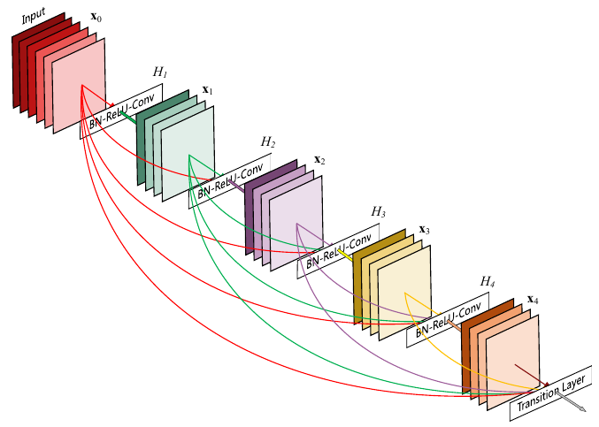
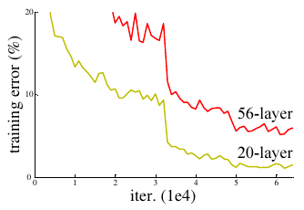
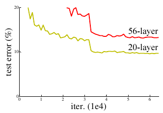

<!-- adam_page1.png page 1 -->

# ADAM: A METHOD FOR STOCHASTIC OPTIMIZATION

Diederik P. Kingma
*
University of Amsterdam, OpenAI
dpkingma@openai.com

Published as a conference paper at ICLR 2015

Jimmy Lei Ba*
University of Toronto
jimmy@psi.utoronto.ca

## ABSTRACT

We introduce Adam, an algorithm for first-order gradient-based optimization of
stochastic objective functions, based on adaptive estimates of lower-order mo-
ments. The method is straightforward to implement, is computationally efficient,
has little memory requirements, is invariant to diagonal rescaling of the gradients,
and is well suited for problems that are large in terms of data and/or parameters.
The method is also appropriate for non-stationary objectives and problems with
very noisy and/or sparse gradients. The hyper-parameters have intuitive interpre-
tations and typically require little tuning. Some connections to related algorithms,
on which Adam was inspired, are discussed. We also analyze the theoretical con-
vergence properties of the algorithm and provide a regret bound on the conver-
gence rate that is comparable to the best known results under the online convex
optimization framework. Empirical results demonstrate that Adam works well in
practice and compares favorably to other stochastic optimization methods. Finally,
we discuss AdaMax, a variant of Adam based on the infinity norm.

## 1
INTRODUCTION

100000:0

Stochastic gradient-based optimization is of core practical importance in many fields of science and
engineering. Many problems in these fields can be cast as the optimization of some scalar parameter-
ized objective function requiring maximization or minimization with respect to its parameters. If the
function is differentiable w.r.t. its parameters, gradient descent is a relatively eficient optimization
method, since the computation of first-order partial derivatives w.r.t. all the parameters is of the same
computational complexity as just evaluating the function. Often, objective functions are stochastic.
For example, many objective functions are composed of a sum of subfunctions evaluated at different
subsamples of data; in this case optimization can be made more efficient by taking gradient steps
w.r.t. individual subfunctions, i.e. stochastic gradient descent (SGD) or ascent. SGD proved itself
as an efficient and effective optimization method that was central in many machine learning success
stories, such as recent advances in deep learning (Deng et al., 2013; Krizhevsky et al., 2012; Hinton
& Salakhutdinov, 2006; Hinton et al., 2012a; Graves et al., 2013). Objectives may also have other
sources of noise than data subsampling, such as dropout (Hinton et al., 2012b) regularization. For
all such noisy objectives, effi cient stochastic optimization techniques are required. The focus of this
paper is on the optimization of stochastic objectives with high-dimensional parameters spaces. In
these cases, higher-order optimization methods are ill-suited, and discussion in this paper will be
restricted to first-order methods.

We propose Adam, a method for effi cient stochastic optimization that only requires first-order gra-
dients with little memory requirement. The method computes individual adaptive learning rates for
different parameters from estimates of first and second moments of the gradients; the name Adam
is derived from adaptive moment estimation. Our method is designed to combine the advantages
of two recently popular methods: AdaGrad (Duchi et al., 2011), which works well with sparse gra-
dients, and RMSProp (Tieleman & Hinton, 2012), which works well in on-line and non-stationary
settings; important connections to these and other stochastic optimization methods are clarified in
section 5. Some of Adam's advantages are that the magnitudes of parameter updates are invariant to
rescaling of the gradient, its stepsizes are approximately bounded by the stepsize hyperparameter,
it does not require a stationary objective, it works with sparse gradients, and it naturally performs a
form of step size annealing.

*Equal contribution. Author ordering determined by coin flip over a Google Hangout.

1

<!-- attention_page1.png page 1 -->

# Attention Is All You Need

Provided proper attribution is provided, Google hereby grants permission to
reproduce the tables and fi gures in this paper solely for use in journalistic or
scholarly works.

Ashish Vaswani*
Google Brain
avaswani@google.com

Llion Jones
*
Google Research
llion@google.com

C20

Noam Shazeer*
Google Brain
noam@google.com

Niki Parmar*
Jakob Uszkoreit*
Google Research
Google Research
nikip@google.com
usz@google.com

Aidan N. Gomez
*
十
University of Toronto
aidan@cs.toronto.edu

Lukasz Kaiser
*
Google Brain
lukaszkaiser@google.com

Illia Polosukhin* 
illia.polosukhin@gmail.com

## Abstract

The dominant sequence transduction models are based on complex recurrent or
convolutional neural networks that include an encoder and a decoder. The best
performing models also connect the encoder and decoder through an attention
mechanism. We propose a new simple network architecture, the Transformer,
based solely on attention mechanisms, dispensing with recurrence and convolutions
entirely. Experiments on two machine translation tasks show these models to
be superior in quality while being more parallelizable and requiring significantly
less time to train. Our model achieves 28.4 BLEU on the WMT 2014 English-
to-German translation task, improving over the existing best results, including
ensembles, by over 2 BLEU. On the WMT 2014 English-to-French translation task,
our model establishes a new single-model state-of-the-art BLEU score of 41.8 after
training for 3.5 days on eight GPUs, a small fraction of the training costs of the
best models from the literature. We show that the Transformer generalizes well to
other tasks by applying it successfully to English constituency parsing both with
large and limited training data.

*Equal contribution. Listing order is random. Jakob proposed replacing RNNs with self-attention and started
the effort to evaluate this idea. Ashish, with Illia, designed and implemented the first Transformer models and
has been crucially involved in every aspect of this work. Noam proposed scaled dot-product attention, multi-head
attention and the parameter-free position representation and became the other person involved in nearly every
detail. Niki designed, implemented, tuned and evaluated countless model variants in our original codebase and
tensor2tensor. Llion also experimented with novel model variants, was responsible for our initial codebase, and
efficient inference and visualizations. Lukasz and Aidan spent countless long days designing various parts of and
implementing tensor2tensor, replacing our earlier codebase, greatly improving results and massively accelerating
our research.

†Work performed while at Google Brain.

Work performed while at Google Research.

31st Conference on Neural Information Processing Systems (NIPS 2017), Long Beach, CA, USA.

<!-- batchnorm_page1.png page 1 -->

# Batch Normalization: Accelerating Deep Network Training by
Reducing Internal Covariate Shift

Sergey Ioffe
Google Inc., sioffe@ google.com

Christian Szegedy
Google Inc., szegedy@ google.com

## Abstract

Training Deep Neural Networks is complicated by the fact
that the distribution of each layer's inputs changes during
training, as the parameters of the previous layers change.
This slows down the training by requiring lower learning
rates and careful parameter initialization, and makes it no-
toriously hard to train models with saturating nonlineari-
ties. We refer to this phenomenon as internal covariate
shift, and address the problem by normalizing layer in-
puts. Our method draws its strength from making normal-
ization a part of the model architecture and performing the
normalization for each training mini-batch. Batch Nor-
malization allows us to use much higher learning rates and
be less careful about initialization. It also acts as a regu-
larizer, in some cases eliminating the need for Dropout.
Applied to a state-of-the-art image classification model,
Batch Normalization achieves the same accuracy with 14
times fewer training steps, and beats the original model
by a significant margin. Using an ensemble of batch-
normalized networks, we improve upon the best published
result on ImageNet classification: reaching 4.9% top-5
validation error (and 4.8% test error), exceeding the ac-
curacy of human raters.

## 1 Introduction

 5 00

Deep learning has dramatically advanced the state of the
art in vision, speech, and many other areas. Stochas-
tic gradient descent (SGD) has proved to be an effec-
tive way of training deep networks, and SGD variants
such as momentum (Sutskever et al.
2013
and Adagrad
Duchi et al.
2011) have been used to achieve state of the
art performance. SGD optimizes the parameters Θ of the
network, so as to minimize the loss

$$
\Theta=\operatorname{a r g}\operatorname*{m i n}_{\Theta}\frac{1}{N}\sum_{i=1}^{N}\ell(\operatorname{x}_{i},\Theta).
$$

$$
\frac{1}{m}\frac{\partial\ell(\mathrm{x}_{i},\Theta)}{\partial\Theta}.
$$

1

Using mini-batches of examples, as opposed to one exam-
ple at a time, is helpful in several ways. First, the gradient
of the loss over a mini-batch is an estimate of the gradient
over the training set, whose quality improves as the batch
size increases. Second, computation over a batch can be
much more efficient than m computations for individual
examples, due to the parallelism afforded by the modern
computing platforms.

$$
\ell=F_{2}(F_{1}(\mathrm{u},\Theta_{1}),\Theta_{2})
$$

$$
\begin{array}{r}{\ell=F_{2}(\mathrm{x},\Theta_{2}).}\end{array}
$$

While stochastic gradient is simple and effective, it
requires careful tuning of the model hyper-parameters,
specifically the learning rate used in optimization, as well
as the initial values for the model parameters. The train-
ing is complicated by the fact that the inputs to each layer
are affected by the parameters of all preceding layers — so
that small changes to the network parameters amplify as
the network becomes deeper.

The change in the distributions of layers’ inputs
presents a problem because the layers need to continu-
ously adapt to the new distribution. When the input dis-
tribution to a learning system changes, it is said to experi-
ence covariate shift
Shimodaira
2000). This is typically
handled via domain adaptation
Jiang
2008). However,
the notion of covariate shift can be extended beyond the
learning system as a whole, to apply to its parts, such as a
sub-network or a layer. Consider a network computing

where F1 and F2 are arbitrary transformations, and the
parameters Θ1, Θ2 are to be learned so as to minimize
the loss l. Learning Θ2 can be viewed as if the inputs
x = F1(u, Θ1) are fed into the sub-network

$$
\Theta_{2}\leftarrow\Theta_{2}-\frac{\alpha}{m}\sum_{i=1}^{m}\frac{\partial F_{2}(\operatorname{x}_{i},\Theta_{2})}{\partial\Theta_{2}}
$$

For example, a gradient descent step

where x1.…N is the training data set. With SGD, the train-
ing proceeds in steps, and at each step we consider a mini-
batch x1.…m of size m. The mini-batch is used to approx-
imate the gradient of the loss function with respect to the
parameters, by computing

(for batch size m and learning rate α) is exactly equivalent
to that for a stand-alone network F2 with input x. There-
fore, the input distribution properties that make training
more efficient – such as having the same distribution be-
tween the training and test data – apply to training the
sub-network as well. As such it is advantageous for the
distribution of x to remain fixed over time. Then, Θ2 does

<!-- bert_page1.png page 1 -->

# BERT: Pre-training of Deep Bidirectional Transformers for
Language Understanding

Jacob Devlin Ming-Wei Chang Kenton Lee Kristina Toutanova

Google AI Language

{jacobdevlin,mingweichang,kentonl,kristout}@google.com

## Abstract

We introduce a new language representa-
tion model called BERT, which stands for
Bidirectional Encoder Representations from
Transformers. Unlike recent language repre-
sentation models (Peters et al., 2018a; Rad-
ford et al., 2018), BERT is designed to pre-
train deep bidirectional representations from
unlabeled text by jointly conditioning on both
left and right context in all layers. As a re-
sult, the pre-trained BERT model can be fine-
tuned with just one additional output layer
to create state-of-the-art models for a wide
range of tasks, such as question answering and
language inference, without substantial task
specific architecture modifications.

BERT is conceptually simple and empirically
powerful. It obtains new state-of-the-art re-
sults on eleven natural language processing
tasks, includingpushingthe GLUE scoreto
80.5% (7.7% point absolute improvement),
MultiNLI accuracy to 86.7% (4.6% absolute
improvement), SQuAD v1.1 question answer-
ing Test F1 to 93.2 (1.5 point absolute im-
provement) and SQuAD v2.0 Test F1 to 83.1
(5.1 point absolute improvement).

## 1
Introduction

10 0000

Language model pre-training has been shown to
be effective for improving many natural language
processing tasks (Dai and Le, 2015; Peters et al.,
2018a; Radford et al., 2018; Howard and Ruder,
2018). These include sentence-level tasks such as
natural language inference (Bowman et al., 2015;
Williams et al., 2018) and paraphrasing (Dolan
and Brockett, 2005), which aim to predict the re-
lationships between sentences by analyzing them
holistically, as well as token-level tasks such as
named entity recognition and question answering,
where models are required to produce fine-grained
output at the token level (Tjong Kim Sang and
De Meulder, 2003; Rajpurkar et all., 2016).

There are two existing strategies for apply-
ing pre-trained language representations to down-
stream tasks: feature-based and fine-tuning. The
feature-based approach, such as ELMo(Peters
et al., 2018a), uses task-specific architectures that
include the pre-trained representations as addi-
tional features. The fine-tuning approach, such as
the Generative Pre-trained Transformer (OpenAI
GPT) (Radford et all., 2018), introduces minimal
task-specific parameters, and is trained on the
downstream tasks by simply fine-tuning all pre-
trained parameters. The two approaches share the
same objective function during pre-training, where
they use unidirectional language models to learn
general language representations.

We argue that current techniques restrict the
power of the pre-trained representations, espe-
cially for the fine-tuning approaches. The ma-
jor limitation is that standard language models are
unidirectional, and this limits the choice of archi-
tectures that can be used during pre-training. For
example, in OpenAI GPT, the authors use a left-to-
right architecture, where every token can only at-
tend to previous tokens in the self-attention layers
of the Transformer (Vaswani et al., 2017). Such re-
strictions are sub-optimal for sentence-level tasks,
and could be very harmful when applying fine-
tuning based approaches to token-level tasks such
as question answering, where it is crucial to incor-
porate context from both directions.

In this paper, we improve the fi ne-tuning based
approaches by proposing BERT: Bidirectional
Encoder Representations from Transformers.
BERT alleviates the previously mentioned unidi-
rectionality constraint by using a "masked lan-
guage model" (MLM) pre-training objective, in-
spired by the Cloze task (Taylor, 1953). The
masked language model randomly masks some of
the tokens from the input, and the objective is to
predict the original vocabulary id of the masked

<!-- densenet_page1.png page 1 -->

# Densely Connected Convolutional Networks

Gao Huang*
*
Cornell University
gh349@cornell.edu

Zhuang Liu*
Tsinghua University
liuzhuangl3@mails.tsinghua.edu.cn

Kilian Q. Weinberger
Cornell University
kqw4@cornell.edu

Laurens van der Maaten
Facebook AI Research
lvdmaaten@fb.com

## Abstract

Recent work has shown that convolutional networks can
be substantially deeper, more accurate, and efficient to train
if they contain shorter connections between layers close to
the input and those close to the output. In this paper, we
embrace this observation and introduce the Dense Convo-
lutional Network (DenseNet), which connects each layer
to every other layer in a feed-forward fashion. Whereas
traditional convolutional networks with L layers have L
connections—one between each layer and its subsequent
layer—our network has
L(L+1)
2
direct connections. For
each layer, the feature-maps of all preceding layers are
used as inputs, and its own feature-maps are used as inputs
into all subsequent layers. DenseNets have several com-
pelling advantages: they alleviate the vanishing-gradient
problem, strengthen feature propagation, encourage fea-
ture reuse, and substantially reduce the number of parame-
ters. We evaluate our proposed architecture on four highly
competitive object recognition benchmark tasks (CIFAR-10,
CIFAR-100, SVHN, and ImageNet). DenseNets obtain sig-
nificant improvements over the state-of-the-art on most of
them, whilst requiring less computation to achieve high per-
formance. Code and pre-trained models are available at
https://github.com/liuzhuang13/DenseNet.

e 0
1066101098:88

## 1. Introduction

Convolutional neural networks (CNNs) have become
the dominant machine learning approach for visual object
recognition. Although they were originally introduced over
20 years ago [18], improvements in computer hardware and
network structure have enabled the training of truly deep
CNNs only recently. The original LeNet5 [19] consisted of
5 layers, VGG featured 19 [29], and only last year Highway

* Authors contributed equally

1

Figure 1: A 5-layer dense block with a growth rate of k = 4.
Each layer takes all preceding feature-maps as input.

Networks [34] and Residual Networks (ResNets) [11] have
surpassed the 100-layer barrier.

As CNNs become increasingly deep, a new research
problem emerges: as information about the input or gra-
dient passes through many layers, it can vanish and "wash
out" by the time it reaches the end (or beginning) of the
network. Many recent publications address this or related
problems. ResNets [11] and Highway Networks [34] by-
pass signal from one layer to the next via identity connec-
tions. Stochastic depth [13] shortens ResNets by randomly
dropping layers during training to allow better information
and gradient flow. FractalNets [17] repeatedly combine sev-
eral parallel layer sequences with different number of con-
volutional blocks to obtain a large nominal depth, while
maintaining many short paths in the network. Although
these different approaches vary in network topology and
training procedure, they all share a key characteristic: they
create short paths from early layers to later layers.

Input
X0
H1
BN-ReLU-Conv
X1
H2
BN-ReLU-Conv
X2
H_3
BN-ReL-Conv
X₃
H4$
BN-ReLU-Conv
X4
Transition Layer

<!-- faster-rcnn_page1.png page 1 -->

# Faster R-CNN: Towards Real-Time Object
Detection with Region Proposal Networks

Shaoqing Ren, Kaiming He, Ross Girshick, and Jian Sun

Abstract—State-of-the-art object detection networks depend on region proposal algorithms to hypothesize object locations.
Advances like SPPnet [1] and Fast R-CNN [2] have reduced the running time of these detection networks, exposing region
proposal computation as a bottleneck. In this work, we introduce a Region Proposal Network (RPN) that shares full-image
convolutional features with the detection network, thus enabling nearly cost-free region proposals. An RPN is a fully convolutional
network that simultaneously predicts object bounds and objectness scores at each position. The RPN is trained end-to-end to
generate high-quality region proposals, which are used by Fast R-CNN for detection. We further merge RPN and Fast R-CNN
into a single network by sharing their convolutional features—using the recently popular terminology of neural networks with
"attention" mechanisms, the RPN component tells the unified network where to look. For the very deep VGG-16 model [3],
our detection system has a frame rate of 5fps (including all steps) on a GPU, while achieving state-of-the-art object detection
accuracy on PASCAL VOC 2007, 2012, and MS cOCO datasets with only 300 proposals per image. In ILSVRC and COCO
2015 competitions, Faster R-CNN and RPN are the foundations of the 1st-place winning entries in several tracks. Code has been
made publicly available.

Index Terms—Object Detection, Region Proposal, Convolutional Neural Network.

■

## 1
INTRODUCTION

e  

Recent advances in object detection are driven by
the success of region proposal methods (e.g., [4])
and region-based convolutional neural networks (R-
CNNs) [5]. Although region-based CNNs were com-
putationally expensive as originally developed in [5],
their cost has been drastically reduced thanks to shar-
ing convolutions across proposals [1], [2]. The latest
incarnation, Fast R-CNN [2], achieves near real-time
rates using very deep networks [3], when ignoring the
time spent on region proposals. Now, proposals are the
test-time computational bottleneck in state-of-the-art
detection systems.

Region proposal methods typically rely on inex-
pensive features and economical inference schemes.
Selective Search [4], one of the most popular meth-
ods, greedily merges superpixels based on engineered
low-level features. Yet when compared to efficient
detection networks [2], Selective Search is an order of
magnitude slower, at 2 seconds per image in a CPU
implementation. EdgeBoxes [6] currently provides the
best tradeoff between proposal quality and speed,
at 0.2 seconds per image. Nevertheless, the region
proposal step still consumes as much running time
as the detection network.

S. Ren is with University of Science and Technology of China, Hefei,
China. This work was done when S. Ren was an intern at Microsoft
Research. Email: sqren@mail.ustc.edu.cn

K. He and J. Sun are with Visual Computing Group, Microsoft
Research. E-mail: {kahe,jiansun}@microsoft.com

R. Girshick is with Facebook AI Research. The majority of this work
was done when R. Girshick was with Microsoft Research. E-mail:
rbg@fb.com

One may note that fast region-based CNNs take
advantage of GPUs, while the region proposal meth-
ods used in research are implemented on the CPU,
making such runtime comparisons inequitable. An ob-
vious way to accelerate proposal computation is to re-
implement it for the GPU. This may be an effective en-
gineering solution, but re-implementation ignores the
down-stream detection network and therefore misses
important opportunities for sharing computation.

In this paper, we show that an algorithmic change—
computing proposals with a deep convolutional neu-
ral network—leads to an elegant and effective solution
where proposal computation is nearly cost-free given
the detection network's computation. To this end, we
introduce novel Region Proposal Networks (RPNs) that
share convolutional layers with state-of-the-art object
detection networks [1], [2]. By sharing convolutions at
test-time, the marginal cost for computing proposals
is small (e.g., 10ms per image).

Our observation is that the convolutional feature
maps used by region-based detectors, like Fast R-
CNN,can also be used for generating region pro-
posals. On top of these convolutional features,we
construct an RPN by adding a few additional con-
volutional layers that simultaneously regress region
bounds and objectness scores at each location on a
regular grid. The RPN is thus a kind of fully convo-
lutional network (FCN) [7] and can be trained end-to-
end specifically for the task for generating detection
proposals.

RPNs are designed to efficiently predict region pro-
posals with a wide range of scales and aspect ratios. In
contrast to prevalent methods [8], [9], [1], [2] that use

<!-- resnet_page1.png page 1 -->

# Deep Residual Learning for Image Recognition

Kaiming He

Xiangyu Zhang

Shaoqing Ren
Jian Sun

Microsoft Research

{kahe, v-xiangz, v-shren, jiansun}@microsoft.com

## Abstract

Deeper neural networks are more difficult to train. We
present a residual learning framework to ease the training
of networks that are substantially deeper than those used
previously. We explicitly reformulate the layers as learn-
ing residual functions with reference to the layer inputs, in-
stead of learning unreferenced functions. We provide com-
prehensive empirical evidence showing that these residual
networks are easier to optimize, and can gain accuracy from
considerably increased depth. On the ImageNet dataset we
evaluate residual nets with a depth of up to 152 layers—8×
deeper than VGG nets [41] but still having lower complex-
ity. An ensemble of these residual nets achieves 3.57% error
on the ImageNet test set. This result won the 1st place on the
ILSVRC 2015 classification task. We also present analysis
on CIFAR-10 with 100 and 1000 layers.

 e.e
3802000003

The depth of representations is of central importance
for many visual recognition tasks. Solely due to our ex-
tremely deep representations, we obtain a 28% relative im-
provement on the COCO object detection dataset. Deep
residual nets are foundations of our submissions to ILSVRC
& COCo 2015 competitions1, where we also won the 1st
places on the tasks of ImageNet detection, ImageNet local-
ization, CoCO detection, and CoCO segmentation.

## 1. Introduction

Deepconvolutional neural networks [22, 21] have led
to a series of breakthroughs for image classification [21,
50, 40]. Deep networks naturally integrate low/mid/high-
level features [50] and classifiers in an end-to-end multi-
layer fashion, and the "levels" of features can be enriched
by the number of stacked layers (depth). Recent evidence
[41, 44] reveals that network depth is of crucial importance,
and the leading results [41, 44, 13, 16] on the challenging
ImageNet dataset [36] all exploit "very deep" [41] models,
with a depth of sixteen [41] to thirty [16]. Many other non-
trivial visual recognition tasks [8, 12, 7, 32, 27] have also

1http://image-net.org/challenges/LsvRc/2015/
and
http://mscoco.org/dataset/#detections-challenge2015.

1

Figure 1. Training error (left) and test error (right) on CIFAR-10
with 20-layer and 56-layer "plain" networks. The deeper network
has higher training error, and thus test error. Similar phenomena
on ImageNet is presented in Fig. 4.

greatly benefi ted from very deep models.

20
mMM
n   
10
56-layer
20-layer
0
r
3
→
5
6
iter. (1e4)

Driven by the significance of depth, a question arises: Is
learning better networks as easy as stacking more layers?
An obstacle to answering this question was the notorious
problem of vanishing/exploding gradients [1, 9], which
hamper convergence from the beginning. This problem,
however, has been largely addressed by normalized initial-
ization [23, 9, 37, 13] and intermediate normalization layers
[16], which enable networks with tens of layers to start con-
verging for stochastic gradient descent (SGD) with back-
propagation [22].

20r
V
e e s
10
56-layer
20-layer
9
2
3
4
5
6
iter. (1e4)

When deeper networks are able to start converging, a
degradation problem has been exposed: with the network
depth increasing, accuracy gets saturated (which might be
unsurprising) and then degrades rapidly. Unexpectedly,
such degradation is not caused by overfitting, and adding
more layers to a suitably deep model leads to higher train-
ing error, as reported in [11, 42] and thoroughly verified by
our experiments. Fig. 1 shows a typical example.

The degradation (of training accuracy) indicates that not
all systems are similarly easy to optimize. Let us consider a
shallower architecture and its deeper counterpart that adds
more layers onto it. There exists a solution by construction
to the deeper model: the added layers are identity mapping,
and the other layers are copied from the learned shallower
model. The existence of this constructed solution indicates
that a deeper model should produce no higher training error
than its shallower counterpart. But experiments show that
our current solvers on hand are unable to find solutions that

<!-- unet_page1.png page 1 -->

# U-Net:Convolutional Networks for Biomedical
Image Segmentation

Olaf Ronneberger, Philipp Fischer, and Thomas Brox

Computer Science Department and BIOSS Centre for Biological Signalling Studies,
University of Freiburg, Germany

ronneber@informatik.uni-freiburg.de,

WWW home page: http://lmb.informatik.uni-freiburg.de/

Abstract. There is large consent that successful training of deep net-
works requires many thousand annotated training samples. In this pa-
per, we present a network and training strategy that relies on the strong
use of data augmentation to use the available annotated samples more
effi ciently. The architecture consists of a contracting path to capture
context and a symmetric expanding path that enables precise localiza-
tion. We show that such a network can be trained end-to-end from very
few images and outperforms the prior best method (a sliding-window
convolutional network) on the ISBI challenge for segmentation of neu-
ronal structures in electron microscopic stacks. Using the same net-
work trained on transmitted light microscopy images (phase contrast
and DIC) we won the ISBI cell tracking challenge 2015 in these cate-
gories by a large margin. Moreover, the network is fast. Segmentation
of a 512x512 image takes less than a second on a recent GPU. The full
implementation (based on Caffe) and the trained networks are available
at http://lmb.informatik.uni-freiburg.de/people/ronneber/u-net.

## 1
Introduction

 0

In the last two years, deep convolutional networks have outperformed the state of
the art in many visual recognition tasks, e.g. [7,3]. While convolutional networks
have already existed for a long time [8], their success was limited due to the
size of the available training sets and the size of the considered networks. The
breakthrough by Krizhevsky et al. [7] was due to supervised training of a large
network with 8 layers and millions of parameters on the ImageNet dataset with
1 million training images. Since then, even larger and deeper networks have been
trained [12].

Thetypical use of convolutional networks is on classification tasks, where
the output to an image is a single class label. However, in many visual tasks,
especially in biomedical image processing, the desired output should include
localization, i.e., a class label is supposed to be assigned to each pixel. More-
over, thousands of training images are usually beyond reach in biomedical tasks.
Hence, Ciresan et al. [1] trained a network in a sliding-window setup to predict
the class label of each pixel by providing a local region (patch) around that pixel

<!-- vgg_page1.png page 1 -->

# VERY DEEP CONVOLUTIONAL NETWORKS
FOR LARGE-SCALE IMAGE RECOGNITION

Published as a conference paper at ICLR 2015

Karen Simonyan* & Andrew Zisserman+

Visual Geometry Group, Department of Engineering Science, University of Oxford
{karen,az}@robots.ox.ac.uk

## ABSTRACT

In this work we investigate the effect of the convolutional network depth on its
accuracy in the large-scale image recognition seting. Our main contribution is
a thorough evaluation of networks of increasing depth using an architecture with
very small (3 × 3) convolution filters, which shows that a significant improvement
on the prior-art configurations can be achieved by pushing the depth to 16–19
weight layers. These findings were the basis of our ImageNet Challenge 2014
submission, where our team secured the first and the second places in the localisa-
tion and classification tracks respectively. We also show that our representations
generalise well to other datasets, where they achieve state-of-the-art results. We
have made our two best-performing ConvNet models publicly available to facili-
tate further research on the use of deep visual representations in computer vision.

## 1
INTRODUCTION

  0

Convolutional networks (ConvNets) have recently enjoyed a great success in large-scale im-
age and video recognition (
Krizhevsky et al.
2012
Zeiler & Fergus
2013
Sermanet et all.
2014
Simonyan & Zisserman,
2014) which has become possible due to the large public image reposito-
ries, such as ImageNet (Deng et al.,
2009), and high-performance computing systems, such as GPUs
or large-scale distributed clusters (Dean et al.
2012.In ricul,ipatleheadvance
of deep visual recognition architectures has been played by the ImageNet Large-Scale Visual Recog-
nition Challenge (ILSVRC)
Russakovsky et al.
2014
which has served as a testbed for a few
generationsof large-scaleimage classification systems,from high-dimensional shallow feature en-
codin
Perronnin et all.
2010) (the winner of ILSVRC-2011) to deep ConvNets (Krizhevsky et al.
2012
(the winner of ILSVRC-2012).

With ConvNets becoming more of a commodity in the computer vision field, a number of at-
tempts have been made to improve the original architecture of
Krizhevsky et all.
2012
in a
bid to achieve better accuracy. For instance, the_ best-performing submissions to the ILSVRC-
2013
Zeiler & Fergus
2013
Sermanet et al.
2014
utilised smaller receptive window size and
smaller stride of the first convolutional layer. Another line of improvements dealt with training
and testing the networks densely over the whole image and over multiple scales (Sermanet et al.,
2014
Howard
2014). In this paper, we address another important aspect of ConvNet architecture
design – its depth. To this end, we fix other parameters of the architecture, and steadily increase the
depth of the network by adding more convolutional layers, which is feasible due to the use of very
small (3 × 3) convolution filters in all layers.

As a result, we come up with significantly more accurate ConvNet architectures, which not only
achieve the state-of-the-art accuracy on ILSVRC classification and localisation tasks, but are also
applicable to other image recognition datasets, where they achieve excellent performance even when
used as a part of a relatively simple pipelines (e.g. deep features classified by a linear SVM without
fine-tuning). We have released our two best-performing models
门
to facilitate further research.

The rest of the paper is organised as follows. In Sect.
2
we describe our ConvNet configurations.
The details of the image classification training and evaluation are then presented in Sect.③ and the

*
current affiliation: Google DeepMind +current affi liation: University of Oxford and Google DeepMind

http://www.robots.ox.ac.uk/~vgg/research/very_deep/

<!-- vit_page1.png page 1 -->

# An IMAGE IS WORTH 16x16 WORDS:
TRANSFORMERS FOR IMAGE RECOGNITiON AT SCALE

Published as a conference paper at ICLR 2021

Alexey Dosovitskiy*,, Lucas Beyer*, Alexander Kolesnikov*, Dirk Weissenborn*,
Xiaohua Zhai*, Thomas Unterthiner, Mostafa Dehghani, Matthias Minderer,
Georg Heigold, Sylvain Gelly, Jakob Uszkoreit, Neil Houlsby*,†
*
equal technical contribution,equal advising

Google Research, Brain Team
{adosovitskiy, neilhoulsby}@google.com

## ABSTRACT

While the Transformer architecture has become the de-facto standard for natural
language processing tasks, its applications to computer vision remain limited. In
vision, attention is either applied in conjunction with convolutional networks, or
used to replace certain components of convolutional networks while keeping their
overall structure in place. We show that this reliance on CNNs is not necessary
and a pure transformer applied directly to sequences of image patches can perform
very well on image classification tasks. When pre-trained on large amounts of
data and transferred to multiple mid-sized or small image recognition benchmarks
(ImageNet, CIFAR-100, VTAB, etc.), Vision Transformer (ViT) attains excellent
results compared to state-of-the-art convolutional networks while requiring sub-
stantially fewer computational resources to train
E

## 1
INTRODUCTION

 e
12008800000500

Self-attention-based architectures, in particular Transformers
Vaswani et al.
2017
havebecome
the model of choice in natural language processing (NLP). The dominant approach is to pre-train on
a large text corpus and then fine-tune on a smaller task-specific dataset
Devlin et al.
2019
Thanks
to Transformers'computational efficiency and scalability, it has become possible to train models of
unprecedented size, with over 100B parameters
Brown et al.
2020
Lepikhin et al.
2020
With the
models and datasets growing, there is still no sign of saturating performance.

In computer vision, however, convolutional architectures remain dominant
LeCun etal.
1989
Krizhevsky et al.
2012
He et al.
2016]. Inspired by NLP successes, multiple works try combining
CNN-like architectures with self-attention
Wang et al.
2018
Carion et al.
2020
),some replacing
the convolutions entirely
(Ramachandran et al.2019
Wang et al. 2020a). The latter models, while
theoretically efficient, have not yet been scaled effectively on modern hardware accelerators due to
the use of specialized attention patterns. Therefore, in large-scale image recognition, classic ResNet-
like architectures are still state of the art
Mahajan et al.
2018
Xie et al.
2020
Kolesnikov et al.
[2020]

Inspired by the Transformer scaling successes in NLP, we experiment with applying a standard
Transformer directly to images, with the fewest possible modifications. To do so, we split an image
into patches and provide the sequence of linear embeddings of these patches as an input to a Trans-
former. Image patches are treated the same way as tokens (words) in an NLP application. We train
the model on image classification in supervised fashion.

When trained on mid-sized datasets such as ImageNet without strong regularization, these mod-
els yield modest accuracies of a few percentage points below ResNets of comparable size. This
seemingly discouraging outcome may be expected: Transformers lack some of the inductive biases

1Fine-tuning code and pre-trained models are available at
https://github.com/
google-research/vision_transformer

1
